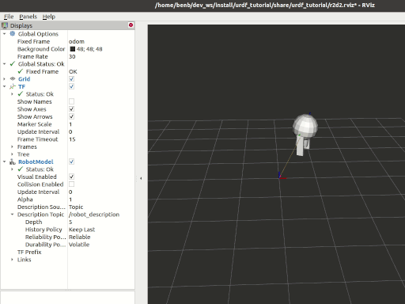

# Using urdf with robot_state_publisher

**Description:** This ROS 2 tutorial gives a full example of a robot model in URDF that uses _robot_state_publisher_. First, we create the URDF model with all the necessary parts. Then we write a node which publishes the JointState and transforms. Finally, we run all the parts together and use Rviz to visualize. 

(Inspired by this [ROS 1 tutorial](http://wiki.ros.org/urdf/Tutorials/Using%20urdf%20with%20robot_state_publisher). I extend my gratitude to the original authors.) 



**Keywords:** robot_state_publisher urdf

**Tutorial Level:** INTERMEDIATE

## Contents
- Create the URDF File
- Publishing the State
- Launch File
- Viewing the Results
---
<br/>

>If you want to skip the tutorial, copy the _urdf_tutorial_ folder into your ROS workspace then run:

```
$ cd %YOUR_ROS_WS%
$ colcon build --symlink-install --packages-select urdf_tutorial
$ source install/setup.bash
$ ros2 launch urdf_tutorial demo.launch.py
$ ros2 launch urdf_tutorial rviz.launch.py  # on 2nd console
```
Otherwise, do these steps.

## 1. Create a package

```
$ cd ~/dev_ws/src  # change as needed
$ ros2 pkg create urdf_tutorial --build-type ament_python --dependencies rclpy
```
You should see the _urdf_tutorial_ folder that contains the starting files for making a ROS 2 Python package.

## 2. Create the URDF File

Here is the [URDF file](http://wiki.ros.org/urdf/Tutorials/Using%20urdf%20with%20robot_state_publisher?action=AttachFile&do=get&target=model.xml) for a 7-link model roughly approximating R2-D2. Save it as ~/dev_ws/src/urdf_tutorial/urdf/r2d2.urdf.xml

In order to view the robot in Rviz, save this [Rviz config](https://github.com/benbongalon/ros2-migration/blob/master/urdf_tutorial/urdf/r2d2.rviz) as ~/dev_ws/src/urdf_tutorial/urdf/r2d2.rviz

> Note: Both files must be in the subfolder 'urdf'

## 3. Publishing the State

Now we need a method for specifying what state the robot is in. To do this, we must specify all three joints and the overall odometry. 

Fire up your favorite editor and paste the following code into the src/urdf_tutorial/urdf_tutorial/state_publisher.py file.

> Note: Make sure to save it in the Python "urdf_tutorial" subfolder where the `__init__.py` file is located.

<br/>

```
#! /usr/bin/env python

from math import sin, cos, pi
import threading
import rclpy
from rclpy.node import Node
from rclpy.qos import QoSProfile
from geometry_msgs.msg import Quaternion
from sensor_msgs.msg import JointState
from tf2_ros import TransformBroadcaster, TransformStamped


class StatePublisher(Node):

    def __init__(self):
        rclpy.init()
        super().__init__('state_publisher')

        qos_profile = QoSProfile(depth=10)
        self.joint_pub = self.create_publisher(JointState, 'joint_states', qos_profile)  # JointStates
        self.broadcaster = TransformBroadcaster(self, qos=qos_profile)
        self.nodeName = self.get_name()
        self.get_logger().info("{0} started".format(self.nodeName))

        degree = pi / 180.0
        loop_rate = self.create_rate(30)

        # robot state
        tilt = 0.
        tinc = degree
        swivel = 0.
        angle = 0.
        height = 0.
        hinc = 0.005

        # message declarations
        odom_trans = TransformStamped()
        odom_trans.header.frame_id = 'odom'
        odom_trans.child_frame_id = 'axis'
        joint_state = JointState()

        try:
            while rclpy.ok():
                rclpy.spin_once(self)

                # update joint_state
                now = self.get_clock().now()
                joint_state.header.stamp = now.to_msg()
                joint_state.name = ['swivel', 'tilt', 'periscope']
                joint_state.position = [swivel, tilt, height]

                # update transform
                # (moving in a circle with radius=2)
                odom_trans.header.stamp = now.to_msg()
                odom_trans.transform.translation.x = cos(angle)*2
                odom_trans.transform.translation.y = sin(angle)*2
                odom_trans.transform.translation.z = 0.7
                odom_trans.transform.rotation = \
                    euler_to_quaternion(0, 0, angle + pi/2) # roll,pitch,yaw

                # send the joint state and transform
                self.joint_pub.publish(joint_state)
                self.broadcaster.sendTransform(odom_trans)

                # Create new robot state
                tilt += tinc
                if tilt < -0.5 or tilt > 0.0:
                    tinc *= -1
                height += hinc
                if height > 0.2 or height < 0.0:
                    hinc *= -1
                swivel += degree
                angle += degree/4

                # This will adjust as needed per iteration
                loop_rate.sleep()

        except KeyboardInterrupt:
            pass


def euler_to_quaternion(roll, pitch, yaw):
    qx = sin(roll/2) * cos(pitch/2) * cos(yaw/2) - cos(roll/2) * sin(pitch/2) * sin(yaw/2)
    qy = cos(roll/2) * sin(pitch/2) * cos(yaw/2) + sin(roll/2) * cos(pitch/2) * sin(yaw/2)
    qz = cos(roll/2) * cos(pitch/2) * sin(yaw/2) - sin(roll/2) * sin(pitch/2) * cos(yaw/2)
    qw = cos(roll/2) * cos(pitch/2) * cos(yaw/2) + sin(roll/2) * sin(pitch/2) * sin(yaw/2)
    return Quaternion(x=qx, y=qy, z=qz, w=qw)

def main():
    node = StatePublisher()


if __name__ == '__main__':
    main()
```

## 4. Create a Launch File

Create a new "launch" folder. Open your editor and paste the following code, saving it as _launch/demo.launch.py_

```
import os

from ament_index_python.packages import get_package_share_directory
from launch import LaunchDescription
from launch.actions import DeclareLaunchArgument
from launch.substitutions import LaunchConfiguration
from launch_ros.actions import Node


def generate_launch_description():

    use_sim_time = LaunchConfiguration('use_sim_time', default='false')
    urdf_file_name = 'r2d2.urdf.xml'

    print("urdf_file_name : {}".format(urdf_file_name))

    urdf = os.path.join(
        get_package_share_directory('urdf_tutorial'),
        urdf_file_name)

    return LaunchDescription([
        DeclareLaunchArgument(
            'use_sim_time',
            default_value='false',
            description='Use simulation (Gazebo) clock if true'),

        Node(
            package='robot_state_publisher',
            executable='robot_state_publisher',
            name='robot_state_publisher',
            output='screen',
            parameters=[{'use_sim_time': use_sim_time}],
            arguments=[urdf]),

        Node(
            package='urdf_tutorial',
            executable='state_publisher',
            name='state_publisher',
            output='screen'),
    ])
```

## 5. Edit the setup.py file

You must tell the **colcon** build tool how to install your Python package. Edit the setup.py file as follows:
- include these import statements

```
import os
from glob import glob
from setuptools import setup
from setuptools import find_packages
```
- append these 2 lines inside _data_files_

```
data_files=[
    ...
    (os.path.join('share', package_name), glob('launch/*.py')),
    (os.path.join('share', package_name), glob('urdf/*'))
],
```
- modify the _entry_points_ table so you can later run 'state_publisher' from a console

```
        'console_scripts': [
            'state_publisher = urdf_tutorial.state_publisher:main'
        ],
```

Save the setup.py file with your changes.

## 6. Install the package

```
$ cd ~/dev_ws
$ colcon build --symlink-install --packages-select urdf_tutorial
$ source install/setup.bash
```

## 7. Viewing the Results

Launch the package

```
$ ros2 launch urdf_tutorial demo.launch.py
```

Run rviz in a new terminal using:

```
$ rviz2 -d ~/dev_ws/install/urdf_tutorial/share/urdf_tutorial/r2d2.rviz
```

> See http://wiki.ros.org/rviz/UserGuide for details on how to use Rviz.

> Note: If you see errors with the message "value is not a valid float", set your locale to 'en_US.UTF-8' as shown in the Installing ROS 2 Guide. ``urdf_parsing`` is known to fail on other locales.
